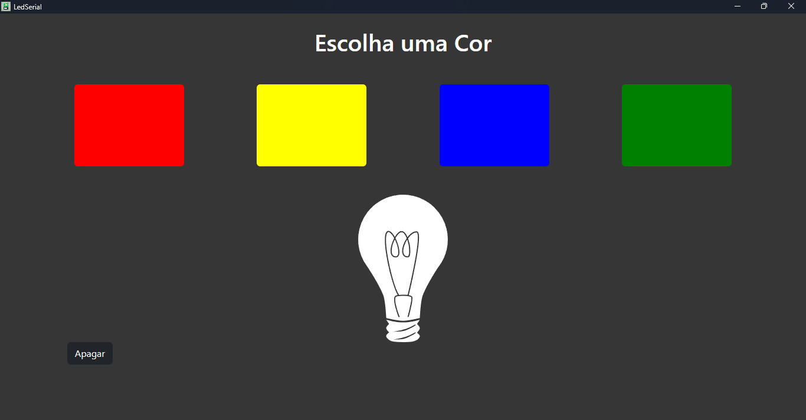

# Aplicativo de Controle de LEDs em Electron.js

Este aplicativo foi desenvolvido com Electron.js para fornecer uma interface intuitiva e amigável que permite o controle de LEDs conectados ao seu dispositivo. Com este aplicativo, você pode facilmente acender, apagar e alternar entre diferentes padrões de luz para os LEDs, tornando-o ideal para projetos de automação residencial, arte interativa ou protótipos eletrônicos.

Esse app trabalha em conjunto com o projeto: [acenderLuzesPelaPortaSerial](https://github.com/jabsonDevElias/acenderLuzesPelaPortaSerial).

### `Status`

Finalizado

### `O que foi Usado?`

- Eletron.js
- Typescript
- Bootstrap

### `Galeria`

   

     
   

